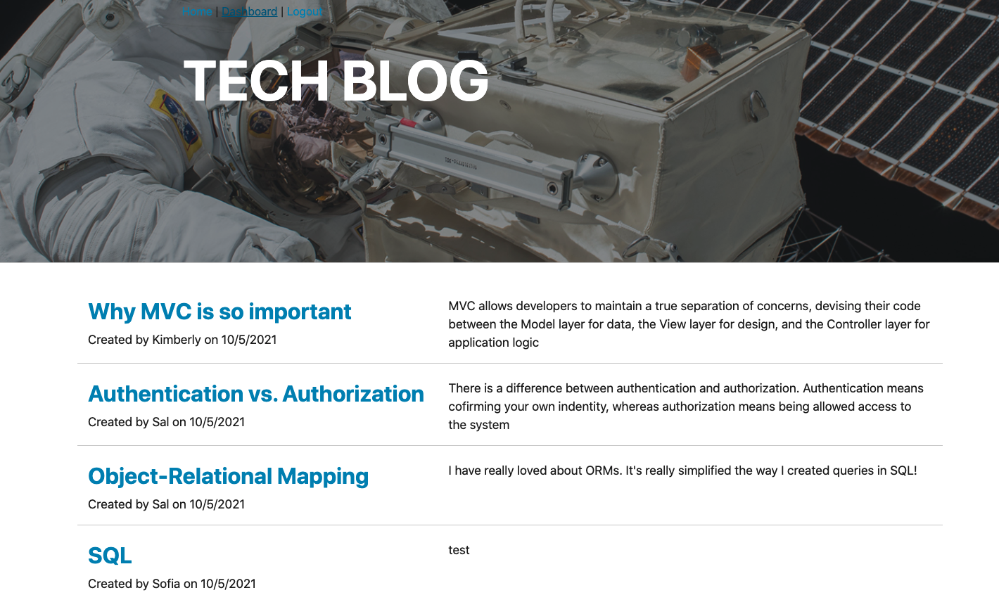

# TechBlog


## Table of Contents

* [Description](#description)
* [Instalation](#instalation)
* [Tools](#tools)
* [Contact](#contact)
* [License](#license)
* [Acknowledgements](#acknowledgements)

## Description

An CMS-style blog site similar to a Wordpress site, where developers can publish their blog posts and comment on other developers’ posts as well.


## Instalation

* Clone the repo (please reference the links below).
```md 
https://github.com/Kimberly-Rodriguez/TechBlog

```



[Site link](https://salty-dusk-96734.herokuapp.com/)

## Tools

 The following tools were used to create this application:  [express-handlebars](https://www.npmjs.com/package/express-handlebars) package to implement Handlebars.js for your Views, [MySQL2](https://www.npmjs.com/package/mysql2) and [Sequelize](https://www.npmjs.com/package/sequelize) packages to connect to a MySQL database for the Models, and an Express.js API for your Controllers.

As well as, [dotenv package](https://www.npmjs.com/package/dotenv) to use environment variables, the [bcrypt package](https://www.npmjs.com/package/bcrypt) to hash passwords, and the [express-session](https://www.npmjs.com/package/express-session) and [connect-session-sequelize](https://www.npmjs.com/package/connect-session-sequelize) packages to add authentication.

Finally, the [express-session](https://www.npmjs.com/package/express-session) package stores the session data on the client in a cookie. When the user is idle on the site for more than a set time, the cookie will expire and the user will be required to log in again to start a new session. This is the default behavior and you do not have to do anything to your application other than implement the npm package.

## Contact

If you have any questions about my work OR wish to collaborate in the future please contact me via email: krodriguez.ucla@gmail.com OR feel free to connect via GitHub: [Kimberly-Rodriguez](https://github.com/Kimberly-Rodriguez).

## License 

Licensed under the [MIT License](LICENSE).

## Acknowledgements

[UCLA Extension Coding Bootcamp](https://bootcamp.uclaextension.edu/coding/)


